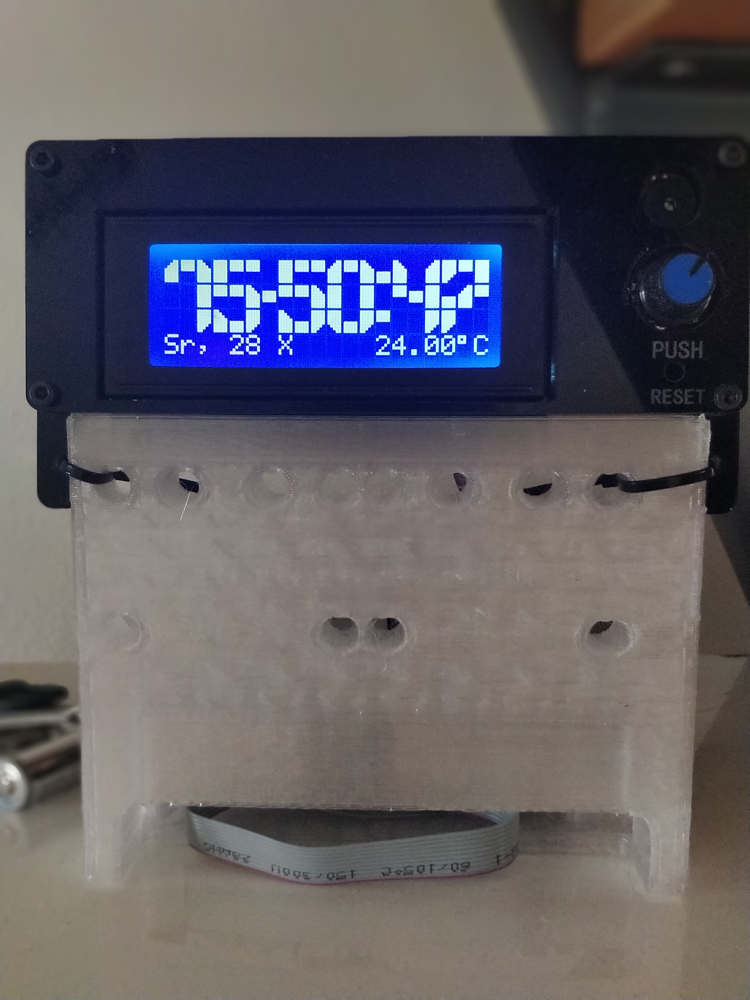

#Arduino based RTC

##About
This is simple clock project built to give second life to a damaged Prusa Printer clone board a second and purposeful life and relive my wife of loud ticking clock. :) 

##Depencies and basic info
 - LiquidCrystal Library
 - Code is built for Arduino Mega or Mega 2560
 - LCD is 20x4 fields with rotary encoder and click (from Prusa Printer clone)
 
##How to
- Clone
- Adapt to your particular board
- Translate menu entries
- Compile and load to (wired) board!

##Additional info
If you do not like the shape of numbers check the bigChar.h file, where all the segments are stored.

Functions:
- buildNum build numbers based on building blocks,
- showNum shows pairs of numbers (two digits for hour, then minute and then second)
- dzienTygodnia translates the integer to day of week string,
- miesiac translates the month integer to roman number of the month (intead of month 8 is VII displayed)\  
 